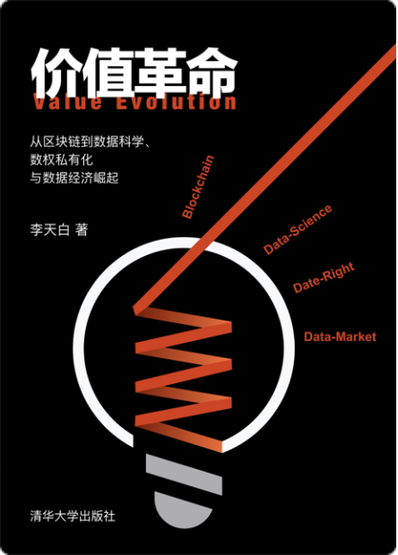

# 价值革命 Value-Evolution 
从区块链到数据科学、数权私有化与数据经济崛起

===

**Author: 李天白** 
**Email: litianbai@me.com**

===

当一个科学或技术呈现于世人面前的时候，总是先惊叹于他的魔力，然后是恐慌与对抗，最后是深陷其中，处之自然。
谨以此书，献给先驱，共勉与同道，更感谢身边的伙伴，尤其是陈良生先生缔造的思源团队。
    
李天白 截稿于2019年6月北京
    
# 内容摘要

本书为不同领域的读者了解区块链技术提供了一个更全面的地图。为区块链技术应用构建了一个更宏伟的框架。并针对未来经济的发展模型提出了大胆的预测。
本书旨在揭示区块链技术展示的更广阔的技术空间，一个由新技术和观念打造的崭新的数据经济的特征和可能的影响。
通过介绍和分析区块链技术，逐渐发现去中心化背后隐藏着一个自主的数据价值体系，可以利用数学和密码学确立价值主体，所属物，以及交易规则。
依赖该体系可以构建出新的“数权”规范，通过“数据私有化”将重构市场格局，以“数据银行”业务为主体，快速创造出万亿级以上的新价值或新财富，让所有参与者享受新经济福利。

# 目录

## [前言](https://github.com/guola/Value-Evolution/blob/master/前言/前言.md)
## 第一章  区块链的启示
### [1.1 比特币传奇](https://github.com/guola/Value-Evolution/blob/master/第一章%20区块链的启示/1.01%20比特币传奇.md)
### [1.2 解析比特币背后的逻辑](https://github.com/guola/Value-Evolution/blob/master/第一章%20区块链的启示/1.02%20解析比特币背后的逻辑.md)
### [1.3 来自观念和习惯的挑战](https://github.com/guola/Value-Evolution/blob/master/第一章%20区块链的启示/1.03%20来自观念和习惯的挑战.md)
### [1.4 横向创新与纵向创新	](https://github.com/guola/Value-Evolution/blob/master/第一章%20区块链的启示/1.04%20横向创新与纵向创新.md)
### [1.5 人类社会的发展和账本技术的创新密不可分](https://github.com/guola/Value-Evolution/blob/master/第一章%20区块链的启示/1.05%20人类社会的发展和账本技术的创新密不可分.md)
### [1.6 共识机制与链的进化	](https://github.com/guola/Value-Evolution/blob/master/第一章%20区块链的启示/1.06%20共识机制与链的进化.md)
### [1.7 宽泛账本与严格账本	](https://github.com/guola/Value-Evolution/blob/master/第一章%20区块链的启示/1.07%20宽泛账本与严格账本.md)
### [1.8 数字货币对现有金融体系的冲击](https://github.com/guola/Value-Evolution/blob/master/第一章%20区块链的启示/1.08%20数字货币对现有金融体系的冲击.md)
### [1.9 更公平的信用体系](https://github.com/guola/Value-Evolution/blob/master/第一章%20区块链的启示/1.09%20更公平的信用体系.md)
### [1.10 全球化与精细化价值经济](https://github.com/guola/Value-Evolution/blob/master/第一章%20区块链的启示/1.10%20全球化与精细化价值经济.md)
### [1.11 创造力的价值](https://github.com/guola/Value-Evolution/blob/master/第一章%20区块链的启示/1.11%20创造力的价值.md)
### 第二章 从区块链到数据科学
### [2.1 发现之旅](https://github.com/guola/Value-Evolution/blob/master/第二章%20从区块链到数据科学/2.01%20发现之旅.md)
### [2.2 神奇的密码学](https://github.com/guola/Value-Evolution/blob/master/第二章%20从区块链到数据科学/2.02%20神奇的密码学.md)
### [2.3 数据的数学原理](https://github.com/guola/Value-Evolution/blob/master/第二章%20从区块链到数据科学/2.03%20数据的数学原理.md)
### [2.4 非交互式零知识证明](https://github.com/guola/Value-Evolution/blob/master/第二章%20从区块链到数据科学/2.04%20非交互式零知识证明.md)
### [2.5 数据细胞技术](https://github.com/guola/Value-Evolution/blob/master/第二章%20从区块链到数据科学/2.05%20数据细胞技术.md)
### [2.6 数据安全的新范式](https://github.com/guola/Value-Evolution/blob/master/第二章%20从区块链到数据科学/2.06%20数据安全的新范式.md)
### [2.7 端到端加密数据与分布式账本](https://github.com/guola/Value-Evolution/blob/master/第二章%20从区块链到数据科学/2.07%20端到端加密数据与分布式账本.md)
### [2.8 去中心的云存储](https://github.com/guola/Value-Evolution/blob/master/第二章%20从区块链到数据科学/2.08%20去中心的云存储.md)
### [2.9 去中心通讯网络](https://github.com/guola/Value-Evolution/blob/master/第二章%20从区块链到数据科学/2.09%20去中心通讯网络.md)
### [2.10 数字身份的保障体系](https://github.com/guola/Value-Evolution/blob/master/第二章%20从区块链到数据科学/2.10%20数字身份的保障体系.md)
### [2.11 如何构建一个完整的应用生态](https://github.com/guola/Value-Evolution/blob/master/第二章%20从区块链到数据科学/2.11%20如何构建一个完整的应用生态.md)
### 第三章 数据私有化引爆数据经济
### [3.1 解读私有化](https://github.com/guola/Value-Evolution/blob/master/第三章%20数据私有化引爆数据经济/3.01%20解读私有化.md)
### [3.2 让数据变成新的经济增长点](https://github.com/guola/Value-Evolution/blob/master/第三章%20数据私有化引爆数据经济/3.02%20让数据变成新的经济增长点.md)
### [3.3 物联网的数据私有化](https://github.com/guola/Value-Evolution/blob/master/第三章%20数据私有化引爆数据经济/3.03%20物联网的数据私有化.md)
### [3.4 大数据的数据私有化](https://github.com/guola/Value-Evolution/blob/master/第三章%20数据私有化引爆数据经济/3.04%20大数据的数据私有化.md)
### [3.5 人工智能的数据私有化](https://github.com/guola/Value-Evolution/blob/master/第三章%20数据私有化引爆数据经济/3.05%20人工智能的数据私有化.md)
### [3.6 融合数据造富平台](https://github.com/guola/Value-Evolution/blob/master/第三章%20数据私有化引爆数据经济/3.06%20融合数据造富平台.md)
### [3.7 个人数据银行](https://github.com/guola/Value-Evolution/blob/master/第三章%20数据私有化引爆数据经济/3.07%20个人数据银行.md)
### [3.8 数据市场](https://github.com/guola/Value-Evolution/blob/master/第三章%20数据私有化引爆数据经济/3.08%20数据市场.md)
### [3.9 用时间转换价值](https://github.com/guola/Value-Evolution/blob/master/第三章%20数据私有化引爆数据经济/3.09%20用时间转换价值.md)
### [3.10 引爆数据经济](https://github.com/guola/Value-Evolution/blob/master/第三章%20数据私有化引爆数据经济/3.10%20引爆数据经济.md)
### 第四章 隐私保护和信息安全
### [4.1 说说隐私](https://github.com/guola/Value-Evolution/blob/master/第四章%20隐私保护和信息安全/4.01%20说说隐私.md)
### [4.2 哈希证明系统的设计范式](https://github.com/guola/Value-Evolution/blob/master/第四章%20隐私保护和信息安全/4.02%20哈希证明系统的设计范式.md)
### [4.3 生物特征数据滥用的安全隐患](https://github.com/guola/Value-Evolution/blob/master/第四章%20隐私保护和信息安全/4.03%20生物特征数据滥用的安全隐患.md)
### [4.4 数据殖民时代的终结者](https://github.com/guola/Value-Evolution/blob/master/第四章%20隐私保护和信息安全/4.04%20数据殖民时代的终结者.md)
### [4.5 被数据呵护的生活](https://github.com/guola/Value-Evolution/blob/master/第四章%20隐私保护和信息安全/4.05%20被数据呵护的生活.md)
### 第五章 区块链+	
### [5.1 区块链+政府](https://github.com/guola/Value-Evolution/blob/master/第五章%20区块链%2B/5.1%20区块链+政府.md)
### [5.2 区块链+教育](https://github.com/guola/Value-Evolution/blob/master/第五章%20区块链%2B/5.2%20区块链+教育.md)
### [5.3 区块链+医疗卫生](https://github.com/guola/Value-Evolution/blob/master/第五章%20区块链%2B/5.3%20区块链+医疗卫生.md)
### [5.4 区块链+商业](https://github.com/guola/Value-Evolution/blob/master/第五章%20区块链%2B/5.4%20区块链+商业.md)
### [5.5 区块链+能源与环境](https://github.com/guola/Value-Evolution/blob/master/第五章%20区块链%2B/5.5%20区块链+能源与环境.md)
### [结语](https://github.com/guola/Value-Evolution/blob/master/结语/结语.md)
### [写在后面](https://github.com/guola/Value-Evolution/blob/master/结语/写在后面.md)

