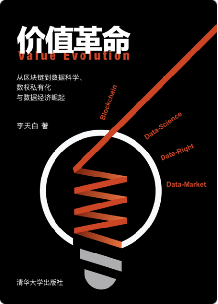

# 价值革命 Value-Evolution 
从区块链到数据科学、数权私有化与数据经济崛起

===

**Author: 李天白** 
**Email: litianbai@me.com**

===

    当一个科学或技术呈现于世人面前的时候，总是先惊叹于他的魔力，然后是恐慌与对抗，最后是深陷其中，处之自然。
    谨以此书，献给先驱，共勉与同道，更感谢身边的伙伴，尤其是陈良生先生缔造的思源团队。
    
    李天白 截稿于2019年6月北京
    
# 内容摘要
    本书为不同领域的读者了解区块链技术提供了一个更全面的地图。为区块链技术应用构建了一个更宏伟的框架。并针对未来经济的发展模型提出了大胆的预测。
本书旨在揭示区块链技术展示的更广阔的技术空间，一个由新技术和观念打造的崭新的数据经济的特征和可能的影响。
通过介绍和分析区块链技术，逐渐发现去中心化背后隐藏着一个自主的数据价值体系，可以利用数学和密码学确立价值主体，所属物，以及交易规则。
依赖该体系可以构建出新的“数权”规范，通过“数据私有化”将重构市场格局，以“数据银行”业务为主体，快速创造出万亿级以上的新价值或新财富，让所有参与者享受新经济福利。

# 目录

前言	
第一章 区块链的启示	
1.1 比特币传奇	
1.2 解析比特币背后的逻辑	
1.3 来自观念和习惯的挑战	
1.4 横向创新与纵向创新	
1.5 人类社会的发展和账本技术的创新密不可分	
1.6 共识机制与链的进化	
1.7 宽泛账本与严格账本	
1.8 数字货币对现有金融体系的冲击	
1.9 更公平的信用体系	
1.10 全球化与精细化价值经济	
1.11 创造力的价值	
第二章 从区块链到数据科学	
2.1 发现之旅	
2.2 神奇的密码学	
2.3 数据的数学原理	
2.4 非交互式零知识证明	
2.5 数据细胞技术	
2.6 数据安全的新范式	
2.7 端到端加密数据与分布式账本	
2.8 去中心的云存储	
2.9 去中心通讯网络	
2.10 数字身份的保障体系	
2.11 如何构建一个完整的应用生态	
第三章 数据私有化引爆数据经济	
3.1 解读私有化
3.2 让数据变成新的经济增长点
3.3 物联网的数据私有化	
3.4 大数据的数据私有化	
3.5 人工智能的数据私有化	
3.6 融合数据造富平台	
3.7 个人数据银行	
3.8 数据市场	
3.9 用时间转换价值	
3.10 引爆数据经济	
第四章 隐私保护和信息安全	
4.1 说说隐私	
4.2 哈希证明系统的设计范式	
4.3 生物特征数据滥用的安全隐患	
4.4 数据殖民时代的终结者
4.5 被数据呵护的生活
第五章 区块链+	
5.1 区块链+政府
5.2 区块链+教育
5.3 区块链+医疗卫生
5.4 区块链+商业
5.5 区块链+能源与环境
结语
写在后面
