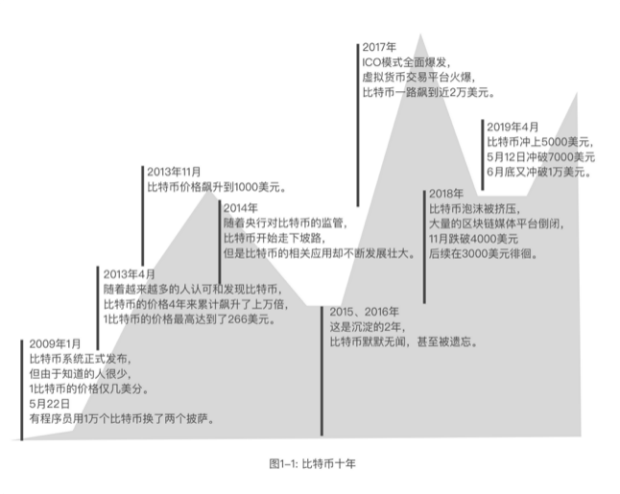

## 1.1 比特币传奇

**危机是创新的沃土。**

2008年由美国“次贷危机[^次贷危机]” 引发的金融海啸席卷全球。曾经市值排名全美第四的大投行，雷曼兄弟因为投资次级抵押住房贷款产品不当，经济蒙受崩盘式的损失，不得不申请破产保护。紧随其后的就是接二连三的金融机构倒闭、大量进出口工厂停业关门，欧洲国家债务缠身、全球经济跌入谷底。

这是牙买加体系的信用货币第一次面临了来自信用滥用而导致的巨大灾难。

中国受金融危机影响，A股和港股的持续大幅低迷，使得国内福布斯富豪榜上有名的80后 “新贵”们的损失合计超过一万亿，2007年首富杨惠妍，作为碧桂园大股东，身家已经缩水千亿元。纸业大亨张茵，身家从253.5亿元人民币跌到约18亿元，被狠狠地甩出富豪榜。经常登上中国富豪榜单的中荣智健，在中信泰富“中招”累股证出现亏损鸿沟时，短短两天的时间损失了66%。创业60多年经历多次经济危机的李嘉诚也未能幸免， 旗舰公司长江实业与和记黄埔的估价股价也一度下跌超过40%，导致李嘉诚的财富在2008年大幅缩水。

公元2009年1月3日，比特币的创始块诞生，这是一个没有任何个人和机构运营的货币系统，只是借助了一个软件。只要大家安装软件，就可以参与到这个庞大的交易系统中，而这个软件的制作者中本聪，迄今没有人知道他是谁。其实是谁也并不重要，因为，在这样的系统中，没有超级管理员，只用共识下的规则。密码学保障的确权体系，基于共识机制的运行规则，以及分布式账本确保的可信数据。

中本聪是这样描述他的初衷：“互联网上的贸易，几乎都需要借助金融机构作为可资信赖的第三方来处理电子支付信息。虽然这类系统在绝大多数情况下都运作良好，但是这类系统仍然内生性地受制于“基于信用的模式”(trust based model)的弱点。我们无法实现完全不可逆的交易，因为金融机构总是不可避免地会出面协调争端，而金融中介的存在，也会增加交易的成本，并且限制了实际可行的最小交易规模，也限制了日常的小额支付交易，并且潜在的损失还在于，很多商品和服务本身是无法退货的，如果缺乏不可逆的支付手段，互联网的贸易就大大受限。因为有潜在的退款的可能，就需要交易双方拥有信任，而商家也必须堤防自己的客户，因此会向客户索取完全不必要的个人信息。而实际的商业行为中，一定比例的欺诈性客户也被认为是不可避免的，相关损失视作销售费用处理，而在使用物理现金的情况下，这些销售费用和支付问题上的不确定性却是可以避免的，因为此时没有第三方信用中介的存在。 所以，我们非常需要这样一种电子支付系统，它基于密码学原理而不基于信用，使得任何达成一致的双方，能够直接进行支付，从而不需要第三方中介的参与，杜绝回滚(reverse)支付交易的可能，这就可以保护特定的卖家免于欺诈。而对于想要保护买家的人来说，在此环境下设立通常的第三方担保机制也可谓轻松加愉快。在这篇论文中，我们将提出一种通过点对点分布式的时间戳服务器来生成依照时间前后排列并加以记录的电子交易证明，从而解决双重支付问题。只要诚实的节点所控制的计算能力的总和，大于有合作关系的(cooperating)攻击者的计算能力的总和，该系统就是安全的。” [^比特币白皮书]

“我们定义，一枚电子货币（an electronic coin）是这样的一串数字签名：每一位所有者通过对前一次交易和下一位拥有者的公钥(Public key) 签署一个随机散列的数字签名，并将这个签名附加在这枚电子货币的末尾，电子货币就发送给了下一位所有者。而收款人通过对签名进行检验，就能够验证该链条的所有者。”

就是这样一个程序，让比特币在2017年12月17日达到历史最高价19850美元；随后在2018年11月25日，比特币跌破4000美元大关，稳定在3000多美元。2019年4月，比特币再次站上5000美元大关，创年内新高；  5月12日，比特币近八个月来首次突破7000美元。

如图1-1所示，可以简单的回顾比特币这些年的一个概貌。

根据2018年的调查统计，运行比特币系统所消耗的能量居然比谷歌，亚马逊，脸书三家计算中心所消耗的能量总和还高，足见比特币对整个信息系统的影响。

尽管部分国家已经接纳了比特币作为合法的支付方式，一些跨境支付平台，如PayPal也接纳了比特币，但比特币支撑的交易规模有限，注定无法成为通用数字货币。

但比特币带动了后续的以太坊、EOS、Hyper Ledger Fabric、Corda等一系列公链和许可链技术的发展，让数字货币或分布式账本技术可以应用到更多的领域。

以太坊是比特币的一个硬分支，但不同于比特币的是，以太坊引进了智能合约的概念，共识机制也做出了调整，被称作区块链2.0。

EOS可以理解为Enterprise Operation System，即为商用分布式应用设计的一款区块链操作系统。EOS是EOS软件引入的一种新的区块链架构，旨在实现分布式应用的性能扩展，注意，它并不是像比特币和以太坊那样是货币，而是基于EOS软件项目之上发布的代币，被称为区块链3.0。

超级账本（hyper ledger）是Linux基金会于2015年发起的推进区块链数字技术和交易验证的开源项目，加入成员包括：荷兰银行（ABN AMRO）、埃森哲（Accenture）等十几个不同利益体，目标是让成员共同合作，共建开放平台，满足来自多个不同行业各种用户案例，并简化业务流程。由于点对点网络的特性，分布式账本技术是完全共享、透明和去中心化的，故非常适合于在金融行业的应用，以及其他的例如制造、银行、保险、物联网等无数个其他行业。通过创建分布式账本的公开标准，实现虚拟和数字形式的价值交换，例如资产合约、能源交易、结婚证书、能够安全和高效低成本的进行追踪和交易。

Corda 是由 R3CEV 推出的一款分布式账本平台，其借鉴了区块链的部分特性，例如 UTXO 模型以及智能合约，但它在本质上又不同于区块链，使用的是新型的存储方式，并非所有人都可以使用这种平台，其面向的是银行间或银行与其商业用户之间的互操作场景。

这像是普罗米修斯的火种，也像是潘多拉的盒子。它的命运要靠我们今天不断的趋善性选择来形成它最后的样貌。

随着十年的发展，大幕徐徐拉开，更多新的创新将涌现出来。也许再过十年，我们会看到一个崭新数据时代的到来。它将深刻的改变我们的生活，尤其是我们如何处理数据，理解数据的价值，用数据建造自己的价值以及社会的价值，让我们可以和人工智能、物联网、大数据之间建立起共赢的、有秩序的、以人为本的新的繁荣社会。

但如果我们选择错误或错失良机，不仅今天的成果会受到数据殖民者的侵害，人工智能，大数据，物联网都可能成为奴役我们生活、盘剥我们价值的工具。

[^比特币白皮书]:内容引自2008年中本聪(Satoshi Nakamoto)在一份鲜为人知的密码学邮件列表上发表的《比特币白皮书》
[^次贷危机]: 美国次贷危机（subprime crisis）也称次级房贷危机，也译为次债危机。它是指一场发生在美国，因次级抵押贷款机构破产、投资基金被迫关闭、股市剧烈震荡引起的金融风暴。它致使全球主要金融市场出现流动性不足危机。美国“次贷危机”是从2006年春季开始逐步显现的。2007年8月开始席卷美国、欧盟和日本等世界主要金融市场。次贷危机目前已经成为国际上的一个热点问题。

