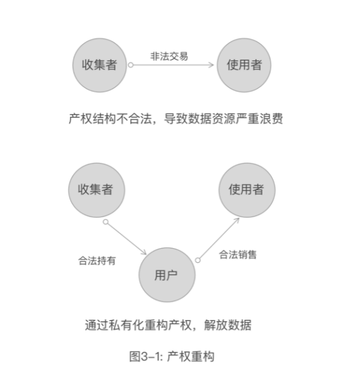
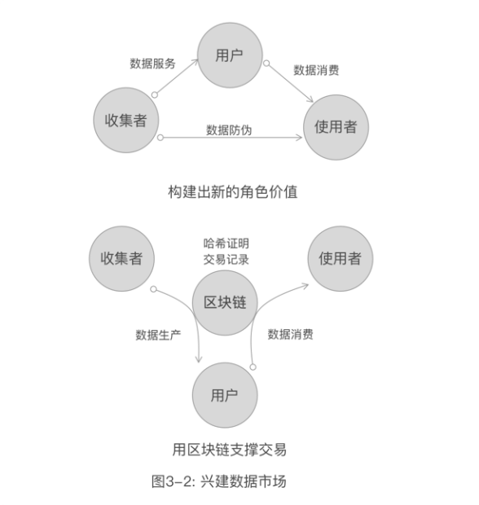
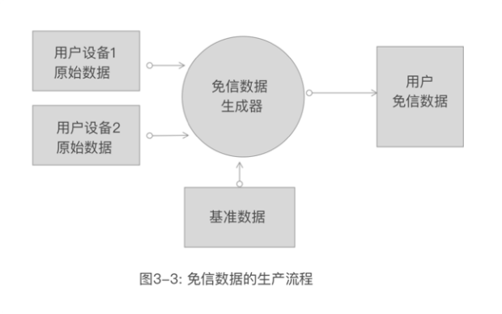

# 3.2 让数据变成新的经济增长点

**如何把积累数据的过程，变成每个人积累财富的过程？**

数字财富运动已经悄然开始，我们的社会财富总量，取决于可交换价值的总量。随着信息技术的发展，数字经济逐步崛起，而承载数字经济的数据也将不断转化为可交换的价值。

就像内燃机的发明，让石油、天然气变成了新财富；半导体技术让广布世界的硅具备了新价值；新材料让稀土成为资源；一个文化营销让钻石变成了爱情的等价物。

未来，不论你用智能手表或其他设备获取的健康数据，你的行为数据、你的观点、你的评价、你的创意，凭借一个可以确权的系统和可以交易的网络的支撑，这些数据都能成为新的财富，也成为新的就业机会，让每个人的创富机会大幅度增加。

这就是数据财富运动。

数据转化为财富，需要三个要件：

1.  意识到数据是财富，并能标记出哪些数据可以转化为财富；
2.  数据可以标记交换价值；
3.  数据可以交易；

为实现上面的三个条件，第一步最重要的启蒙运动是“数据私有化”。

没有人清晰的知道哪些私有数据是可以转化为财富的，也不知道哪些数据是可以私有化的。

例如我们日常的聊天和社交数据，都无偿的奉献给了相关平台，你的社会关系、聊天记录，都记录在了他们的大数据中心，他们怎么变成财富，我们不得而知。

这也就是国外的Telegram和我在的思源设计主导的“秘邮”所做的事，用端到端加密技术，彻底的隔绝了通讯平台对具体关系和聊天数据的使用能力，而且我们进一步将中继消息服务变成任何人和机构可以独立部署的，让软件自己去保护所有人的日常数据使用权和所有权，同时利用Email寻址方式，在匿名性和权威性之间取得平衡。通过对传统Email系统的兼容，可以更多的服务于商业应用。

再如我在的思源设计的“密区”，利用端到端加密技术，只需要一个软件，就可以将现有的云盘，变成你完全独立控制其数据的存储系统，任何云盘的厂商无法监视和滥用你的数据。“密区”内置的分享系统也是端到端加密的，利用现有的社交通道，你可以安全的分享内容。由于分享系统采用了区块链技术，分享本身是可以计费的，这也就意味着，可以方便的将数据变成财富。

但这个过程的价值感依然是比较薄弱和难以感知的。为了推进数据经济的快速发展，我们可以先从数据最为丰富的领域开始，以下以“电信公司盘活数据资产实现产业升级”的方案为例，探讨快速构建数据市场的可能性。

随着5G的落地，移动网络的用户将逐渐摆脱对WiFi的依赖，而直接使用蜂窝数据。移动网络的运营商的话费收入，短信收入随着OTT的流行，大幅缩窄收入能力。如果运营商还持续将自己的定位放在通讯服务上，则面临很大的收入压力，以及增长的困境。

由于用户越来越借助网络完成各类业务，运营商自然记录了大量的客户行为数据，但隐私安全的法律越来越严苛，直接变现这些数据是非法的。而客观的事实是，用户这些数据是有价值的，不管是政府治理、城市规划、卫生防疫、医疗保险都需要这些数据来优化业务，提升服务质量。

如果有方案可以合法的实现这些数据的价值，运营商就可以增加出一个崭新的业务——“数据服务”。也就是说，运营商不仅仅是通道服务商，还可以成为数据服务商。 

首先，用户持有自己的数据是合法合规的，如果用户委托运营商搜集自己更多的数据，也是合法合规的。前提是，运营商不可非法使用和销售这些数据，但运营商可以通过技术手段将数据的使用权交还给用户，并通过这样的数据服务，收取相应的费用。

用户将自己的数据受让或者销售给使用者是合法的。如图3-1所示。

而这样的系统必然是去中心可信的，需要密码学保障的，这就要采用区块链技术。 

用户利用公钥标记自己的身份，获取自己的数据，这些数据是运营商签名确认的，可以确保数据在流转的时候不被篡改，维护数据的权威性，同时，用户可以利用公钥地址销售数据，这样就可以在一定程度上保护隐私。而运营商提供的数据里有用户公钥的锁定，就可以保障用户不能倒卖他人的数据，使用者也就可以合法的使用这些数据。用户通过区块链记录数据的流转，并可以通过区块链进行结算，从而让自己的数据变得更有价值。

整个链条的三方形成了一个价值链条，每一方都通过数据实现了自己的价值。如图3-2所示。

例如，医疗保险想给经常运动的用户打折，那么用户提供的自己的行为轨迹数据，是最好的佐证，经常出入哪些场所，每天的行为健康特性，这些数据时间越长，越可信并具备价值，用户通过提供这些数据，就可以让自己直接获利，而保险公司可以客观的降低自己的运营风险，精细化操作业务。

例如，对于销售型企业，销售员可以提供自己的通话记录，以及行为轨迹，这些数据将帮助企业建立客观的工作量计量系统。

例如，对于交通部门来说，通过直接购买用户数据，可以降低数据搜集成本，规划更好的交通管理策略，对公共交通以及道路规划提供更有力的支持。

例如，用户可以直接将数据卖给电商公司，以期获得很好的个性化服务，优化电商的服务，对物流公司更是如此。

更大的市场在于，如果车联网进入和随身设备数据市场进入，则可以整体上更大规模的带动数据服务产业和通讯服务产业的发展。

免信数据市场-Trustless Data Market

由于数据可以利用设备的交叉互信，生产出“免信数据”，进一步可以扩展出“数据服务”的升级市场。举个案例，随身设备产生的记步数据，经常有用户用钟摆外设来模拟，以制造虚假的运动数据。但如果结合设备的位置与手机的位置，以及GIS（地理信息）的佐证，例如是在健身房，还是办公室，就可以通过交叉计算，获得用户的真实运动数据，我们把这种数据成为“免信数据”。免信数据是基于算法构造的，私有化的，可以把免信数据的生产过程理解为一个智能合约。

电信公司可以提供类似的智能合约化的“免信数据”生产，全面释放大数据计算的能力。如图3-3所示。 

同时，物联网设备先行将数据提交给“免信数据生成器”由智能合约进一步加工成更具价值的数据，则可以建造更大规模的数据基础服务。

总体来说，运营商可以针对性的为自己的用户打造不同的数据服务，甚至可以利用智能合约实时分享这些数据，这是一个巨大的数据市场。

我们不再去侵害消费者的数据权，通过把数据权完全交给消费者，让数据变成所有人可以共享的价值和利益。

以中国现有的用户通讯号码的持有量分析，如果覆盖全市场，应该至少有20亿的节点（手机、车辆、穿戴设备、物联网），以每个几点月数据服务费最低10元计算，则可以利用现有的数据基础设施，打造年收入2400亿的基础市场。

其实同样的模式也适合金融服务业、物联网等领域，如果这些有效的数据资源通过私有化，释放到数据市场(Data Market)将快速推动数据经济的发展。

