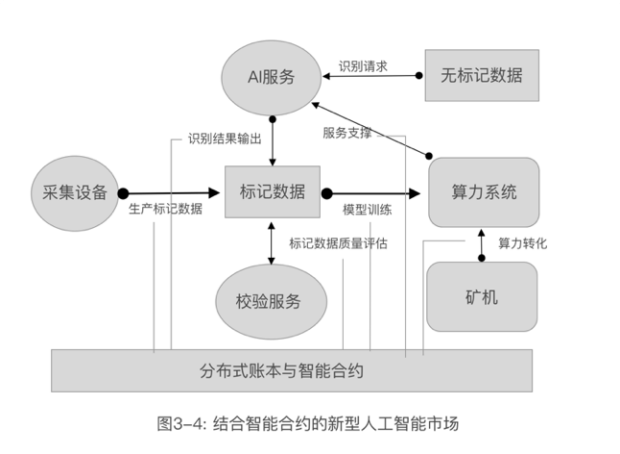

# 3.5 人工智能的数据私有化

**让人工智能变成数据财富的制造商。**

人工智能是一个很大的范畴，这里集中在神经网络和深度学习这一主要领域。

这个领域主要涉及三个方法：辅助学习、自主学习、对抗网络。

辅助学习，是利用标记好目标的数据打分。例如，给出一堆照片，有猫有狗，提前标记这些照片的结果，然后训练神经网络，不断让识别结果更加精确，最后给出一张照片，能判断出是猫是狗。

自主学习，类似拿出一大堆有猫的照片，让神经网络无目的的看，直到发现“猫”这个概念，也就是在任何一张照片中可以判断是否有“猫”。

对抗网络，这样理解，一个网络要学习画猫，那它先开始随便画，每画出一幅，就用前面辅助学习或自主学习训练出的猫识别程序来鉴别，组成一个对抗网络，通过高速训练，一个程序就可以像模像样的画猫了。

这些都需要需要标记的数据或既有的智能参与训练。

可以利用区块链建立目标导向的分布式训练模型，并利用区块链技术建立人工智能服务的输出能力。

举例来说，医疗系统需要血液分析系统，传统的方法是人工利用显微镜来发现血液组成成分的异常，进而对疾病的诊断提供参考。如果让人工智能替代人工，则需要大量的标记数据，就是之前人工观测的样本照片和结果数据。利用区块链，可以建造一个应用闭环，开始的时候，所有提供数据的人或机构，根据提供的数据数量，兑换虚拟币作为股份，计算资源的提供者，根据提供的计算资源获取股份，算法提供者也获得相应的股份。一旦训练成型，就可以利用智能合约对外提供服务，收取的费用，扣除计算成本，就可以按股份比例分配给之前的股东。

由于训练结果是利用智能合约的账号管理加密的，一切业务都是透明并可以保护知识产权的，代码不会有泄漏的风险。

而用于训练的数据，是成员内部可共享的，成员就可以随机抽验数据，对训练数据不断的完善和评级，由此而构成数据社区，持续的完善智能模型。 

Dbrain（dbrain.io）就在尝容试着做类似的业务。

这个模型（如图3-4所示），如果辅助以物联网设备，则可以更大程度上标准化采集数据，将目前的矿机转化为更有前途的AI模型构建和AI服务能力，利用区块链建立数据市场，利用智能合约优化数据，提升算法的服务能力。这是一个动态整合模型，将物联网技术，大数据，算力资源在数据市场上整合为一个超级生态。通过AI服务的大量生产和自由竞争，推进人工智能产业的繁荣。

利用区块链技术（或数据科学）规范对数据的使用。详细的讨论可参看“生物特征数据滥用的安全隐患”一章。

未来还可以利用区块链技术，建立价值训练模型，让AI介入到价值分配系统中，也同时建立基于AI管理的数据市场。
