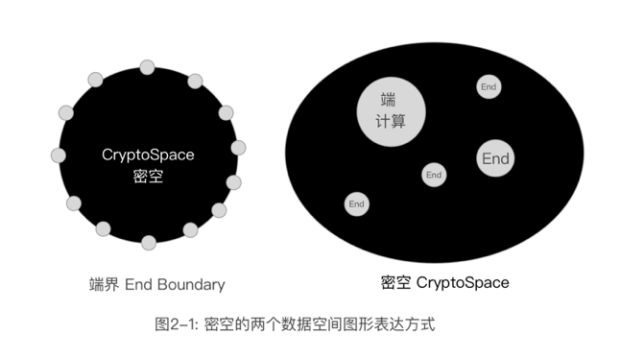

# 2.3 数据的数学原理

**密码学提供了数据确权的最简明模型。**

数学和密码学构造的数据世界，和基于物理网络和中心化规则构建的数据世界是不同的。前者是纯粹数学构建的算法体系，后者是基于物理机械原理建造的模拟系统。

虽然数据依然需要在物理的网络里运行存在，但数据的逻辑可以不依赖于物理网络的规则，和中心化的规则。就像计算可以依据人脑，也可以依据算盘和计算器，虽然基础不同，但可以达成一样的结果。但运算本身和人脑的规则，算盘和计算器的内在原理是不同的，利用数学和密码学构建的信息系统，更趋于信息的本质性特质，也就是用信息本身的数学和密码学特点可以定义其自身的逻辑，并转化为现实的规则。不像现在的系统，是用现实规则构建一个信息系统的内部规则。这有点像日心说和地心说，虽然都能计算和描述日起日落，斗转星移，但日心说是以经典物理学观念构建的算法体系，而地心说使用宗教观念构造的算法体系，这让日心说相对于地心说更加简明，更加有效，更趋近本质。

我们看一下几个关键的数据概念在密码学中是怎么实现和转换的。

1. 如何标记身份

基于时空和介质观念的数字身份ID，一般是指在某个中心化系统中，依据存储递增，或区域码加递增策略生成的，或基于中心系统时间戳，只在这个系统中能够确认唯一的ID。这个中心化系统可以是分布式的，但不违背上述原则，利用中心化系统的鉴权服务来行使身份的使用权。

而基于数学和密码学的数字身份ID，则是依赖一个确定的非对称加密算法，由一个端来计算生成的在概率上接近唯一的ID，也就是公钥，利用端对私钥的保护和使用来行使身份的使用权。

中心化规则的唯一标记 => 基于算法计算的概率上接近唯一的标记。

2. 如何认证身份

基于中心化系统的身份认证条件是该系统中有该身份的记录，以及用于校验和比对的认证信息，通过比对这些特征信息，确认用户的身份。

密码学的身份认证是基于零知识证明，简单的说，利用数字签名来实现，就是用户用私钥加密一段信息，如果能用公钥还原该段信息，则可以认证该用户。

中心化的特征比对 =>利用非对称加密算法对设定数据的加密和还原

3. 任何确认数据的所属关系

基于中心化系统在确认数据所属关系时，基本的方法是使用关系数据模型，通过身份ID和数据的关联记录，建立所属关联，利用访问权的管理实现数据的所属能力确认。

而基于密码学的数据所属关系，可以简单的采用一个算法即可保障，就是用用户的公钥加密数据。由于该数据只能用私钥还原的特性，实现对数据所属权的管理。

中心化的逻辑关联和访问权控制 => 用自己的公钥加密数据

4\. 如何确认数据使用权的转移

基于第三点，中心化系统是修订所属关系或建立新关系。而密码学的数据转移，就是用接收方的公钥加密数据，在区块链上记录这样的转移过程即可。

中心化的关联关系重构 => 用对方的公钥加密数据

5. 如何指代对象

对象的指代是任何高效信息系统的关键。例如，我们用名词指代一个客观世界里的对象，如“马”、“食物”等等。传统信息系统中的指代，一般是用一个系统中的ID对应一个数据实体，这依赖于中心系统对两者关系的确认。例如“身份证号”指代一组由用户姓名、住址、头像、性别、出生日等信息构成的数据。有了身份证号，就可以方便的和其他信息系统建立更加复杂的逻辑关系，例如，婚姻登记是两个身份证号的关联关系。在密码学中，则可以利用算法建立这种指代关系，就是哈希算法。哈希可以将任何数据变成一个固定长度的数据，验证哈希值和数据的对等性，无需任何中心系统，只需要通过运算即可验证，这就是去中心的指代能力。

中心化的指代关系 => 哈希算法

6. 如何建立信用体系或数据的共识体系

传统的信用是用各个中心化账本建造的，依据复式账本原则构建的体系。通过各个中心化系统的规则维护信用，通过协议在各个中心之间建立信用流转。而基于数学和密码学的信用，是利用共识机制建立的分布式数据独立体之间的关系，利用共识确立数据的有效性和准确性，是基于一套行之有效的理论上可验证的数据关系来建立，可以利用程序和算法进行确认。

中心化的各个账户的数据的规则协议 => 共识下的分布式账本

以上的种种特性，指向了一个特点去中心化。去中心化的另一个解读就是数据系统的自证性，也就是可以依赖数学的精确定义来描述，形成一个完备的公理系统。具备自证性特点的系统，才趋近于科学的系统。

数据从此可以摆脱其从属工具的特征，建立了自己的完备体系，形成“数据科学”，从数据科学再到数据科学工程。

数据科学是计算科学的一个子集，符合图灵和哥德尔不完备性定理的数学描述，计算科学的集合，可以定义为“图灵空间”。

哥德尔是奥地利裔美国著名数学家，不完备性定理是他在1931年提出来的。这一理论使数学基础研究发生了划时代的变化，更是现代逻辑史上很重要的一座里程碑。该定理与塔尔斯基的形式语言的真理论，图灵机和判定问题，被赞誉为现代逻辑科学在哲学方面的三大成果。哥德尔证明了任何一个形式系统，只要包括了简单的初等数论描述，而且是自洽的，它必定包含某些系统内所允许的方法既不能证明真也不能证伪的命题。

哥德尔定理是说包含有自然数的数学系统是不完备的。 这一定理造成了重大的认知恐慌。人们发现自己的数学系统无法证明自己是完备的。与此同时，形式化系统可以推广到任意物理存在和宇宙中存在的观点，也让哥德尔定理的影响遍及几乎所有领域。形式化系统就是图灵机。图灵机可以允许的计算能力是有上限的。停机问题不可解这一判断，等价于哥德尔定理的内容。哥德尔定理的适用范围其实非常之广。自然数，迭代，可数，这三者之间基本等价。可以说任何允许进行扩展的形式系统都在哥德尔定理的包含之内。

数据科学主要集中在可以用数学和密码学定义数据关系的领域——“密码空间”（CryptoSpace），简称“密空”。是利用端（End）分离了边界，端和端之间构造了一个可以完备的逻辑体系，支撑数据的所属关系以及交换原则，是端到端之间构成的数据世界，是“图灵空间”的一个子集。

而传统基于明文运算的体系，则隶属于“明文空间”。端内的计算，大多数隶属于“明文空间”，是有序数据之间的关联和运算。 

如图2-1所示，可以用两种方式来图形化描述这个空间的特性。左边是用端包裹一个“密码空间”，像是宇宙的黑洞，端构成了黑洞的视界。右边可以把“密码空间”理解为宇宙的暗物质，端内包裹着“明文空间”。

“明文空间”和“密码空间”构成了“图灵空间”的绝大部份，量子计算是另外一个范式，还可能有其他的计算范式。

密空有些像宇宙学里的暗物质，端就像星球和星系，星球内部可以建立自己的管理规则和运行规则，星系间利用暗物质的规则构建整体的宇宙运行规则。

我们可以用十个基础定理来描述这样的“密空”。

定理一：数据（Data）是固定长度的二进制序列

D = {1,0,1,1…}

定理二：数据和数据可以通过运算符产生新数据，基础运算是加法，也可以是减法，乘法，或异或等，都可以认为是加法的变形。

D = D1 + D2   

定理三：程序（Program）是数据的一种类型，同时可以处理数据。

P = D2  //符合定理一

D  = D1 + P //符合定理二

或 D= P（D1）//符合定理二的函数方便表达式

定理一、二、三，就是一个二进制的图灵机的简单形式化描述，定理三是对定理二的形式简化。

定理四：随机数生成算法（Random Algrithm）是程序的一个特例，可以认为无输入即可随机产生一个数据或数据集合，并且每次产生的结果是不同的。这是数学世界里的无中生有。这非常重要，是密码学的基础。

Random = {D1, D2….}

D1 = P.random

D2 = P.random

D1<> D2

Random = P.random

定理五：加密算法是程序的一个特例，原数据通过密钥和算法生成加密数据。加密数据利用密钥让数据本身具备了两个特性，有序和混乱，也就是可用的数据和无用的数据。通过这个算法，我们就可以控制数据。

符合第二定理的表达式是：

D.encrypted = D + P.encrypt + Key

可转换为函数表达式

D.encrypted= P.encrypt( D, Key)

对称加密的恒等表达式：

D = D.decrypt（P.encrypt( D, Key)，Key）

定理六：非对称算法是随机算法的一个特例，该算法由公私钥生成程序，加密程序，解密程序组成，符合如下特征：公钥加密的数据智能用私钥解密，私钥加密的数据只能用公钥解密。

Algorithm = { P.keygenerator, P.encrypt , P.decrypt}

{PublicKey, PrivateKey} = P.keygenerator;

D = P.decrypt( P.encrypt( D, PublicKey), PrivateKey)

D = P.decrypt( P.encrypt( D, PrivateKey), PublicKey)

定理七：哈希算法是加密算法的一个特例, 任何数据可通过哈希算法单向生成一个固定长度的数据——哈希值(HASH)用作数据摘要或数据ID。这个哈希值可以和数据稳定的建立映射关系，也就是不同的数据都可以利用一个固定长度来指代，指代数据的范围和哈希值的长度有关，也就是哈希的最大值要远远大于要覆盖的数据集合数量的最大值，哈希算法可以为数据建立标签。

HASH = P.encrypt(D)

P.decrypt = null. //没有解密算法

如果 D1= D2 则 P.hash(D1)= P.hash(D2)

如果 HASH1= P.hash(D1) 且 P.hash(D2) = HASH1

则 D1= D2  

定理八：零知识证明和所有者定义。根据定理六，数据的所有者，可以用非对称加密算法生成的公私钥对来定义，利用零知识证明实现身份确认。确认数据所有者的前提是，所有者的私钥只在所有者指定的运算系统中存在，通过所有者运算系统利用私钥加密一段指定的数据，加密后的数据简称数字签名。验证者利用所有者的公钥解密数字签名，如果符合指定的数据，则可以证明对方持有私钥，也就是满足了私钥只在所有者指定的运算系统中存在的前提。通过满足这个前提，实现身份确认。

Owner = {P, {PrivateKey, PublicKey}}

OwnerID = PublicKey

D.signature = P.encrypt( D.chanllege, Owner.PrivateKey)

如果 D.chanllege = P.decrypt(D.signature, Owner.PublicKey)

则 Owner 为真。

定理九：数据关系证明。隶属于数据所有者的数据可以用所有者公钥加密的方式来声明其所有权；此公理可以推演出数据交换规则和数据存储规则。

D.owner = P.encrypt( D, Owner.PublickKey) //算法声明数据的所有权

Owner.data = {D.owner} //所有者的数据是声明所属权的数据集合

Owner1向Owner2的数据权转移可以描述为

D.owner2 = P.encrypt( P.decrypt(D.owner1, Owner1.PrivateKey), Owner2.PublickKey)

如果结合定理五，数据交换可以理解为加密密钥的交换。

定理十：共识机制原理。数据集合之间利用共识机制建造对等的数据集合体，共识机制是基于概率学和博弈学的。

{D1} = {D2} = {D3}=…

等同于

{D} = P.consensus( {D1},{D2},….)

以上是构造出数据科学的数学基础。沿着这个基础可以发展出一系列具体的应用。同时，也对现有的数据安全体系，数据资产管理等领域提供了新的范式。 

所以从整体上说，要建立一套基于数学和密码学的价值体系需要服从下面三个原则：

1.  基于数据本身的确权：数字身份的确认和行为确认是使用公钥标记身份，使用数字签名来验证身份，这就必然导致一个关键的结果，用户的私钥是必须只能是用户生成和持有的。任何其他方法都不具备完整的法理依据。
2.  基于数据存储和使用方式建立的共识：数据必须在算法和体系上保证所有人获取的都是一致的，数据的内容是无法篡改的，所谓历史的客观性原则。
3.  基于透明程序管理的规则：规则是利用可验证的一致性和确定性原则执行，也就是公平性原则。这就要求程序必须采用合理的方法证明其执行的确定性和一致性。类似智能合约。

可信(Trusted)，免信(Trustless)与去中心(Decentralized)

对于基于区块链技术的信息系统，一种说法是可信“Trusted”，而所谓可信，往往又意指为对某个证明系统的依赖，其实“Trusted”往往和中心化是相关的概念。一种提法是“Trustless”，就是无容置疑的意思，也是免除信任的意思，就像“免检”是质量的最高标准，“免信”则是数据的最高标准。也就是说，这是一种数学上的事实，无需任何的特殊证明，即可自证，既然是事实，也就无所谓可信不可信，也就趋于“去中心”概念的本质。利用数学和密码学构造的是“数据事实”（Factful Data），事实是无争议的，是更加稳固的，随处可用的。

但同时“可信区块链”（Trusted Blockchain）则可以认为是区块链技术和中心认证系统结合的新系统。其实，在数据证明性，以及许可链中，都会涉及和一个中心化认证系统的关联，这是一个高可用技术。

而“免信区块链”（Trustless Blockchain）是语意反复，公链大多数是基于这个原则设计的。

基于免信框架的产品则不局限于区块链，任何经过明确数字签名和所属关系证明以及哈希证明的数据，也是去中心的，属于“免信数据”的范畴。

在这里，我试图构建一下这类工程的一些实践准则：

1. 自洽与非排斥原则。这些工程都是遵循数学和密码学原理建造的。数据系统在内在本质上不依赖于利用规则推动的中心化的第三方确信保障。但不排斥和中心化系统的合作。

2. 概率学原则。这是基于概率建造的确定性信息系统。密码学本质上是算力保障的系统，不存在必然的无法破解。因此也只能从概率的角度来论证整个系统的完备性和安全性。

3. 可用性原则。在工程上可以实施。区块链技术是算法依赖的，则必然依赖于运行环境的可靠性。运行环境是复杂的系统工程，尤其是恶意软件。这就要求在工程上辅助多种条件，建立一个可执行的环境。同时要对现有的系统具备一定的兼容性，可以平滑过度。

4. 良知性原则。在道德上坚守良知。每种技术都是双刃剑，不作恶，只能是道德范畴的内在约束，无法用技术直接保障道德的。现有部分智能合约执行的内容是具备侵害性的，虽然符合图灵机原理，透明性机制可以在更大范围内建立纠错机制，不断良化系统，但没有良知的保障，依然是有风险和道德漏洞的。

5. 价值贡献原则。只有在经济上具备独特的价值贡献，兼顾所有参与者的利益和公平性，才可能落地，行走在人世间，成为生活和工作的伴侣。共享数据带来的利益和损害都是同时发生的，尤其是对现有既得利益者的侵害。但如何能够平衡其关系，促进更大的利益增长，让所有人享受增长的福利，则可以让更多的参与者促成其结果。因此，区块链进入的场景，最好不只是重新分配，而是创造新的价值和财富。这样才能普惠到所有参与者。从可行性的角度说，每个项目依然要照顾到初期参与者的心理，降低转化的成本。
