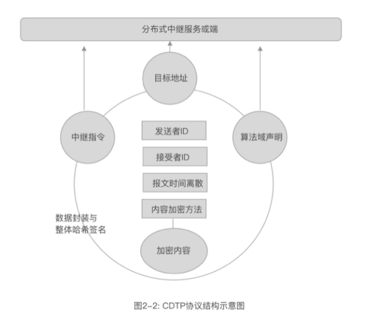

# 2.5 数据细胞技术

**为每条数据确权。**

数据细胞技术，是由一种特殊结构的数据类型的定义方式，和处理这种类型数据的方法构成，服从形式系统的一般规律。具体来说是指对数据本质性的多维度特点，（尤其是把自主生成的时间戳作为重要的离散变量，保障每条数据的离散性）进行结构化封装，形成协议，通过对结构化数据的哈希进行签名，确保数据的不可篡改性以及来源的确定性，而封装在结构化数据里面关键的通讯内容，可采用了非对称加密技术，确保了数据只能为合法用户使用。

简单的说，就是把任何数据进行确权，保障数据不被篡改，破坏，拦截和伪造，每个数据像一个生命体一样的存在，可以独立的使用。其安全性和可用性无关乎任何存储介质、通道、计算环境，是基于密码学的协议化二进制封装，是一种存在于密码学里面的数据实体，可以把数据细胞理解为密空的基本原子。由于，这个机构是利用哈希和数字签名进行密码学封装和包裹，同时内部可以有复杂的形式结构，这个结构可以嵌套化的不断定义，以便于工程使用，同时基本机构又是非常清晰和完整的。我当时找不到合适的词汇来界定这个数据类型，觉得它在空间结构上，非常像一个细胞，于是，就是定义这个类型数据，叫“数据细胞”或叫“细胞型数据”，最后，简称为“数据细胞”（DataCell）。

这样定义还有一个好处，可以描述这类数据在构成更复杂系统的时候的特征。

例如，在传输的时候，传统的数据处理，在存储系统中的数据结构并不直接支持传输，往往都需要进行数据重构，才能在发送端和接受端处理这个数据，而数据细胞是无需处理，直接在通道中搬运即可。

搬运后的存储系统，也不需要破坏数据结构，直接将数据细胞作为一个独立的存储节点，放置在文件系统或数据库中即可。处理时，由于数据细胞具备标记性特征，信息所属对象的特征，自然可以利用中间系统进行转移，这样的存储系统，我把它定义为“数据器官”（DataOrgan）。这里处理数据的方法，也是基于密码学的，只是讲数据根据显性标记进行处理，并不关心信息的具体内容。这给我们今后建立基于密码学的数据库系统，提供了一种范式，这类系统也应该具备和传统系统不同的名字。

由于基于数据细胞构造的数据之间，建立可以互联互通的能力是基于算法的，尤其是在基础上依赖的某种非对称算法，因为不同算法间，无法进行验签，也无法解密。

这些算法，可以理解为是“数据基因”（DataGene），相同算法的数据细胞的集合可以称之为“数据种群”（DataSpecies）。

如果一个算法出现危机，那么，这个“数据种群”就陷入了危机。

不同种群的数据，可以依赖于端来进行苟合。

在这里，“密空”更像是一个生物学空间，反过来，密码学也能为生物学之间的关系，做出一种新的解读。

基因本身的特质是符合我们“数据科学”第一定理和第二定理的，既是数据也是运算器。一个图灵机，根据输入，加工出新的数据，数据又内置了算法，这不就是细胞吗！相同类型的细胞聚合成器官，不同器官构成生物体，一个种群维系着基因的迭代和延续。

这一技术可能会深刻的改变信息技术的发展路径，它会把区块链技术的精神带到一个更加广阔的领域。

为此，我和团队进一步制定了一个可以在工程上使用的协议标准——CDTP（Crypto Data Transaction Protocol）密保数据交换协议。

下面我会略微详细的介绍一下协议本身，也能更清晰的看到数据细胞技术的样貌。如图2-2所示，这是一个具备特殊结构的数据模型。 

CDTP协议首先声明了算法，也就是用于生成公私钥，签名和验签的算法。可以是RSA，也可以是椭圆算法的某个分支，例如国密算法，发送和接收数据包的端，先需要用这个算法标记来确认是否具备相应的处理能力，在高安全级别的应用里，算法可以利用硬件保护，从而让数据无法破解。

设备指纹：是运行的端依据某个非对称算法获得公钥，如需对设备验证，则设备可以用签名方式来求证自己。设备指纹或者叫“端指纹”被封锁在运行安全基中，和软件进行绑定，当然也可以采用其他的方法建造设备指纹，以确立“端”的可信性，这不是必须的要求，只是在特殊场合下，提供的更加安全的保障措施。

发送者公钥及地址：地址主要是用于传输控制便利而设置的，发送者公钥才是关键，利用该公钥，接受者可以建立自己的白名单和黑名单。

接收者公钥及地址：这是为了确认接收方，同时也标记了该信息的所属对象，发送者可以理解为来源，接收者才是持有者。

中继服务指令集：CDTP是为了广泛传输信息设计的，由于接收对象不一定时时在线，或连接不稳定，这就需要一个稳定的中继服务，在“秘邮”的框架里，是Crypto-Mail服务，通过稳定的信息中继服务，让用户的信息安全的存储在云端。中继服务指令主要指对信息分发的处理策略的标记，取决于中继服务的响应能力。

发送者时间戳：是由发送方的端生成的时间戳，主要是为了让相同请求的数据依然可以是不同的，从而可以防重播，也让拦截服务和分布式攻击无法进行。

目标地址：这是指信息在网络上具体送达的中继服务地址或接收方端地址。该地址结合MNS（邮件地址解析服务）和DNS（域名解析服务）可以有效响应分布式服务。

数据和数据加密方法：具体的数据，需要对应的加密方法才能正常加解密。信息的加解密方法可以与身份确认算法不一致，可简单分为明文，对称加密和非对称加密三类。以应对不同的使用环境。

整体签名：就是用发送者的私钥对以上所有数据的哈希进行加密，实现结构化数字签名。

以上的协议，可以理解为一种数据结构，通过这样特殊的结构，构造了一种特殊的报文（Message）。这个报文可以直接为另一个端使用，也可以寄存在中继服务中，或依据现有的协议如HTTP，MQTT等进行传输，当然也可以在TCP/IP层上构建特殊的传输层协议。

