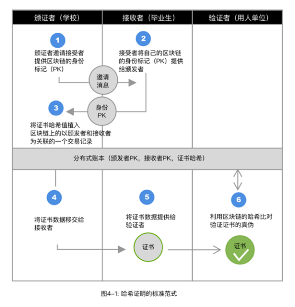
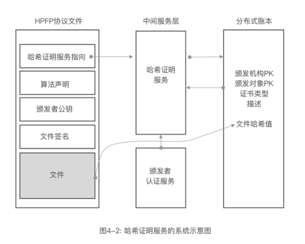

# 4.2 哈希证明系统的设计范式

麻省理工（MIT）在建造区块链学历证明系统blockcerts时，提出了一个基本范式（如图4-1所示）。简单说，就是证书通过通讯系统流转，链上做哈希证明。

这个系统让数据可以去中心的自由流转，只是利用区块链来确保证书的防伪，证书本身就像纸币，可以自由流通，区块链起到的是验钞机的作用。

现在很多运行证书系统，采用的并不是这个方式。

一种思路是数据直接上链，也就是证书数据用发布者的公钥加密。利用智能合约或其他中心化授权系统，再需要访问数据时，解密数据提交给使用方。

一种思路是把链做为管理权限的工具，利用链上提供的授权证书来提供访问对应数据系统的权限。

其现实的原因在于两点，表面上是数据的管理权问题，更深层的是没有一套标准的应用体系支撑数据的流转和证明。

从法理上说，个人证书，使用者是有完全的持有权和出示权。做为颁发机构，可以备份该数据，但原则上，不应该是该数据的最终管理者，也不具备法理上的出示权。

因此，区块链的证书系统，应该是一个完备的系统工程，并不仅仅限于区块链一个系统去解决所有的问题。

至少要有五个关键系统组成，一个是区块链证书证明系统，一个是颁发方的类CA系统，一个是用户安全持有证书的系统，一个是用户可以出示证书的系统，一个是验证方可以方便验证的系统。

这样才能让数据可以合法的流转，不仅可以解决教育领域的证书问题，也可以解决政务领域的证照问题，还能用数字身份在保护隐私的前提下，提供有效的身份或信用证明。

证书证明系统本质来说，就是一个可信的数据分享系统。如果在上述五个系统中，增加证书流转跟踪的区块链系统，则可以广泛的应用于医疗数据，法律证据，知识产权保护和知识产权交易等更广泛的范围。并可以让这些数据产生价值。

区块链主要证明的是颁发机构，持有者，证书，这三者的关系，可以单纯的证明四件事：

(1)证书内容的真伪；

(2)持有者是否合法持有该证书；

(3)证书是哪个颁发机构颁发的；

(4)某颁发机构是否给某用户颁发了某种证书。

这四件事组成了相当多的应用场景，例如，在人事招聘时，面试方可以通过（1）（2）的组合验证应聘者是否是某学历证书的持有者，利用(3)验证颁发机构的合法性，面试者不必再携带原件，也不必复印，伪造的证书也无法流通。

面试者在向用人部门传递数据时，用人部门可以依据（1）来验证数据的真伪，防止中间的篡改，传统过程是依赖复印件和扫描件实现的，很容易造假。

同样，当我们推荐一个人的时候，也可以在对方提供了区块链证书的前提下，直接使用这些“防伪数据”。

利用区块链数学上的可证的技术，就可以加速数据流通的效率和质量，提高社会资源的利用能力，服务于社会，整体降低成本，也降低了对纸张的需求，以及保存成本，流通成本等的消耗，实现绿色的可持续发展。

对持证者的核心价值在于自我管理证书，自由支配所有证书的使用权和出示权，这样能够让证书的价值最大化。持证者，还可以利用智能合约或代理程序增强自己的使用场景。例如一个代理商，可以利用自己的代理程序，向索取证书的用户发送证书，不仅可以证明证书的真伪，还可以证明自己是证书的合法持有者。

对于颁发机构来说，不必再依赖复杂的物理或数字防伪技术的前提下，可获得极强的防伪性。同时，利用链的数据实时性特征，让证书更具价值，利用辅助的CA系统，可以提高颁发机构的权威性。

而数字化的证书，通过链接能力，和复杂数据的存储能力可以适配更多的场景需求。例如，身份证内部可携带生物特征比对数据，用于人脸识别和其他识别，可以内置图灵程序，用于特殊环境下的验证需求，而链接可以扩展信息的容量。例如，学历证中有成绩的检索链接，有颁发机构的介绍，以及其他的重要信息。

甚至证书也可以成为颁发机构的流动广告。

对于验证者来说，不必再接入各种系统、注册各种会员、缴纳各种费用去获得信息的验证，可以随时随地的在合理授权的范围内使用证书内的信息。

由于证书是授权传递的，那么证书信息就杜绝了中间机构滥用的可能。

该系统还可以为任何数据进行证明，颁证机构就是证明方，被颁发对象是被证明方，哈希值可以指向任何数据。

这正是“免信数据”生产的基本方法。通过对生产源和数据服务对象或记录对象的声明，保障数据的准确性和可证性。

这样就把区块链证书系统，拓展为宽泛的去中心的数据证明系统。

如果把证书系统，与交易系统合并，就形成了数据交易网络。任何数据，例如个人的运动数据、健康数据，都可以认为是一个证书，物联网设备，穿戴设备相当于颁发机构，数据就具备了客观性和所属性，在这个前提下，就可以进行交换，并创造价值。

完整的哈希证明系统，是由两个基本系统组成，可证数据流转系统和链式哈希证明系统。

可证的数据流转需要类似HPFP协议的支撑。HPFP是哈希证明文件协议的英文缩写（Hash Proof File Protocol）。该协议由两个部分组成，文件本体部分和声明部分，声明部分包括证明链服务的指向，使用的算法，签发机构的公钥，以及签发机构对文件本体哈希的签名（如图4-2所示）。 

为什么指向的是证明服务，而不是证明链的原因在于，日常用户不可能直接使用链数据来证明文件，代价过高，也不方便。但证明服务是可以被任何人利用链数据来验证的，从而建立哈希证明服务的可靠性。

分布式的证明服务也可以利用类似拜占庭容错共识机制，相互验证各服务的可靠性和准确性，就是每次验证时，可以向多个节点发出请求，通过对多个节点返回的结果，来确认最终结果，并对服务进行评价，从而快速淘汰有害或无效的服务节点，让服务群稳定可靠的工作。这种模型设计的服务，我们称之为“分布式哈希证明服务”。利用区块链技术所提供的模型，从“分布式账本”技术逐渐过渡为“分布式服务”，也就是从去中心的数据层，演变到去中心的服务层。

